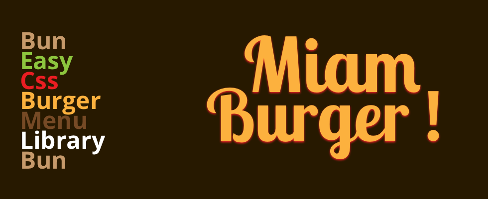

# :hamburger: Miam Burger! - A toasty burger menu library.



## What you'll need

-   A version of [jQuery](https://jquery.com)
-   *Optional: a way to compile scss.*

## How to get set

-   Download the .zip archive

-   Add the *miam-menu-burger.min.css* stylesheet link into your head tag.

```html
<link rel="stylesheet" href="css/miam-menu-burger.min.scss">
```

-   add the *miam-menu-burger.min.js* script file after jquery at the end of your body tag.

```html
<script src="https://cdnjs.cloudflare.com/ajax/libs/jquery/3.2.1/jquery.min.js"></script>
<script src="js/miam-menu-burger.min.js"></script>
```

-   To create a burger menu copy this template in your html file.

```html
  <button class="burger-menu">
    <span class="barre barre__top"></span>
    <span class="barre barre__middle"></span>
    <span class="barre barre__bottom"></span>
  </button>
```

## Make the burger your own!

### Change the face of your menu burger

> You can easily customise your menu with a class attribute.

```html
  <button class="burger-menu align-right">
    <span class="barre barre__top"></span>
    <span class="barre barre__middle"></span>
    <span class="barre barre__bottom"></span>
  </button>
```

**There is 5 different faces.**

-   **classic**: `burger-menu`
-   **various length right aligned**: `align-right`
-   **various length left aligned**: `align-left`
-   **dot menu left aligned**: `dotted-left`
-   **dot menu right aligned**: `dotted-right`

### Change the animation of your menu burger

> Change the animation with a data attribute

```html
  <button class="burger-menu align-right" data-menu-animation="transition-basic">
    <span class="barre barre__top"></span>
    <span class="barre barre__middle"></span>
    <span class="barre barre__bottom"></span>
  </button>
```

**There is 7 to choose from.**

-   `transition-basic`
-   `transition-basic2`
-   `transition-arrow`
-   `transition-arrow-left`
-   `transition-arrow-alt`
-   `transition-arrow-right-alt`
-   `transition-arrow-down-alt`

## Get the full power of the library with scss

You have to navigate through the file `src/sass/helpers/_variables.scss` and edit the sass variables.

| Variables                  | Definition                   |
| -------------------------- | ---------------------------- |
| *$button-background-color* | background color of the menu |
| *$bars-color*              | color of the bars            |
| *$button-border-color*     | border color of the menu     |
| *$bars-height*             | bars height                  |
| *$bars-padding*            | padding between the bars     |
